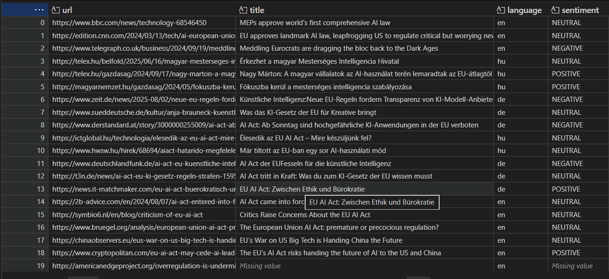
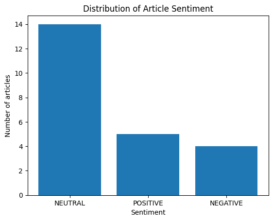
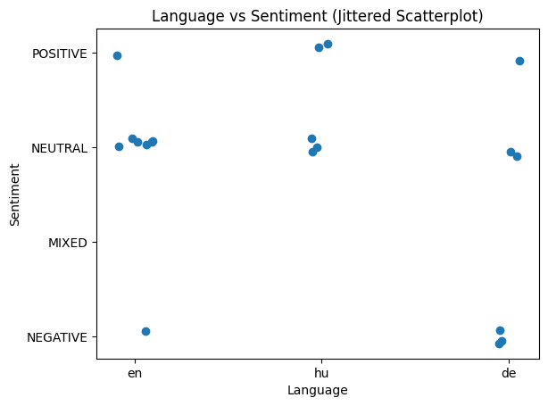

# petruska_de_week_5
## DE 1 Assignment 3 Exercises to Get Your Feet Wet

Date - December 19 2025\
Students - Boga Petruska, Bence Szabo\
Class - ECBS5146: Data Science 1, Fall 2025

## Configuration

### AWS Credentials

This project uses AWS services (Translate, Comprehend, S3) via `boto3`.

To run the code locally:
1. Install the AWS CLI
2. Configure credentials using:

    ```bash
   aws configure
    ```

3. install packages if needed
    ```
    pip install -r requirements.txt
    ```

## The Problem

**Research Objective:** To examine and compare the media sentiment surrounding the EU AI Act of 2024 across three distinct linguistic and geographical regions: English (US/UK), German (Germany/Austria), and Hungarian.

The goal was to determine if local media outlets in these regions perceive the landmark regulation differently.

**Methodology:**

* Collection: Automated web scraping of 20 news articles using a curated URL list.

* Processing: Normalizing multilingual data by translating non-English content into English.

* Analysis: Applying Natural Language Processing (NLP) to quantify sentiment. Because neutral sentences dominate long-form reporting, article sentiment was determined using average sentiment intensity (a ±0.05 threshold between Positive and Negative) rather than simple majority sentence labels.

* Archiving: Storing processed records in a structured JSON format for longitudinal study.


## Data Sources
The study utilized a curated list of URLs targeting high-impact news coverage of the AI Act.
| Language | Article Count | Sample Outlets                                      |
|-----------|----------------|---------------------------------------------------|
| English (en)  | 7 | BBC, CNN, Bruegel, China Observers                       |
| German (de)   | 7 | Zeit, Deutschlandfunk, Der Standard, T3N                 |
| Hungarian (hu)| 6 | Telex, Magyar Nemzet, ICT Global, HWSW                   |

## Workflow & Execution
To arrive at the results, the following technical pipeline was implemented:

* Environment Setup: Configured AWS SDKs (boto3) for Translation, Comprehend (NLP), and S3 storage.

* Scraping: Developed a robust scrape_article function using BeautifulSoup to extract titles, dates, and core body text while filtering out "noise" (ads, navigation links).
    ```
    # UDF - feed in URL,  returns dictionary with title, date, text, error
    def scrape_article(url):

        def get_text_or_none(element):
            return element.get_text(strip=True) if element else None

    headers = {
        "User-Agent": "Mozilla/5.0 (compatible; CEU-Research-Bot/1.0)"
    }

    try:
        r = requests.get(url, headers=headers, timeout=15)
        r.raise_for_status()
    except Exception as e:
        return {
            "title": None,
            "date": None,
            "text": None,
            "error": str(e)
        }

    soup = BeautifulSoup(r.text, "html.parser")

    # ---- TITLE ----
    title = soup.find("h1") or soup.find("meta", property="og:title")
    title = title["content"] if title and title.name == "meta" else get_text_or_none(title)

    # ---- DATE ----
    date = (
        soup.find("time")
        or soup.find("meta", property="article:published_time")
        or soup.find("meta", attrs={"name": "date"})
    )
    date = date.get("datetime") or date.get("content") if date else None

    # ---- TEXT ----
    paragraphs = soup.find_all("p")
    text = "\n".join(
        p.get_text(strip=True)
        for p in paragraphs
        if len(p.get_text(strip=True)) > 40
    )

    return {
        "title": title,
        "date": date,
        "text": text,
        "error": None
    }
    ```

* Translation: Used Amazon Translate to convert Hungarian and German text into English, ensuring the sentiment analysis model (trained primarily on English) maintained high accuracy across all rows.
    ```
    #translate non-english text
    def translate_to_en(text, source_lang):
        """
        Translate text to English using Amazon Translate.
        Handles empty/NaN values.
        """
        if text is None or (isinstance(text, float) and pd.isna(text)) or str(text).strip() == "":
            return None

        resp = translate.translate_text(
            Text=text,
            SourceLanguageCode=source_lang,   # e.g. 'de', 'hu'
            TargetLanguageCode="en"
        )
        return resp["TranslatedText"]
    ```

* Sentiment Scoring: Used Amazon Comprehend with a custom "safe" chunking algorithm. Since news articles often exceed API character limits, the text was broken into logical paragraphs, analyzed, and then re-aggregated to find a weighted average sentiment.
    ```
        # detect sentiment of english language text fed into UDF
    def detect_sentiment_safe(
        text,
        language_code="en",
        max_bytes=4800
    ):
        # ---------- empty text ----------
        if text is None or (isinstance(text, float) and pd.isna(text)) or not str(text).strip():
            return {
                "sentiment": None,
                "chunk_sentiments": [],
                "positive": None,
                "neutral": None,
                "negative": None,
                "mixed": None,
                "n_units": 0,
                "unit_type": "sentence"
            }

        # ---------- sentence split ----------
        sentences = re.split(r"(?<=[.!?])\s+", text)
        sentences = [s for s in sentences if len(s.strip()) > 30]

        sentiments = []
        scores = []

        for s in sentences:
            if len(s.encode("utf-8")) > max_bytes:
                continue

            response = comprehend.detect_sentiment(
                Text=s,
                LanguageCode=language_code
            )

            sentiments.append(response["Sentiment"])
            scores.append(response["SentimentScore"])

        if not scores:
            return {
                "sentiment": None,
                "chunk_sentiments": [],
                "positive": None,
                "neutral": None,
                "negative": None,
                "mixed": None,
                "n_units": 0,
                "unit_type": "sentence"
            }

        # ---------- aggregate ----------
        avg_scores = {
            k: float(np.mean([s[k] for s in scores]))
            for k in scores[0]
        }


        # Because neutral sentences dominate long-form reporting, article sentiment was determined using average sentiment intensity 
        # rather than majority sentence labels.
        
        if avg_scores["Negative"] > avg_scores["Positive"] + 0.05:
            final_sentiment = "NEGATIVE"
        elif avg_scores["Positive"] > avg_scores["Negative"] + 0.05:
            final_sentiment = "POSITIVE"
        else:
            final_sentiment = "NEUTRAL"

        return {
            "sentiment": final_sentiment,
            "chunk_sentiments": sentiments,
            "positive": avg_scores["Positive"],
            "neutral": avg_scores["Neutral"],
            "negative": avg_scores["Negative"],
            "mixed": avg_scores["Mixed"],
            "n_units": len(sentences),
            "unit_type": "sentence"
        }
    ```
* Visualization: Generated histograms and jittered scatterplots to visualize the distribution of sentiment vs. the source language.
    * Table of results:
        
    * Histogram\
        

    * Scatter Plot\
        
## Findings
The following trends were observed in the sentiment distribution:

* Dominant Neutrality: The majority of articles across all languages were classified as NEUTRAL. This reflects the journalistic nature of the sources, which prioritize reporting on the Act's implementation timelines and legal requirements over editorializing.

* Overall Distribution: The sentiment is rarely purely "Positive." Most articles fall into the Neutral or Mixed categories, reflecting the complex, multifaceted nature of high-stakes technology regulation.

## AWS Service Cost Breakdown
This project utilized several AWS cloud services. Below is a breakdown of the costs incurred for the analysis of 20 articles (7 English, 13 requiring translation) with an average length of 6,000 characters.

| Service          | Calculation                                           | Estimated Cost |
|------------------|-------------------------------------------------------|----------------|
| Amazon Translate | 13 articles × 6,000 chars = 78,000 chars ($15/1M)     | $1.17          |
| Amazon Comprehend| 20 articles × 6,000 chars = 120,000 chars ($1/1M)     | $0.12          |
| Amazon S3        | 20 PUT requests + minimal storage                     | $0.0001        |
| **Total per Run**| —                                                     | **~$1.29**     |

